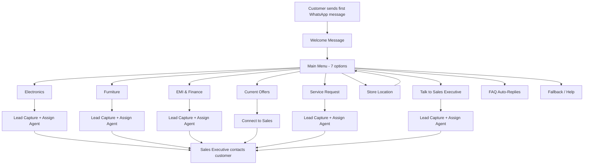
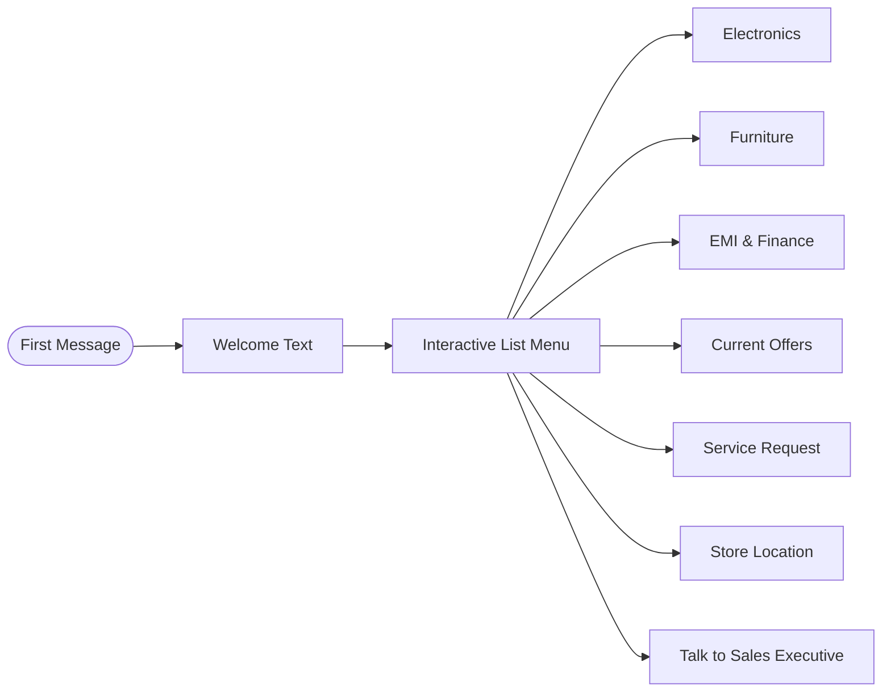
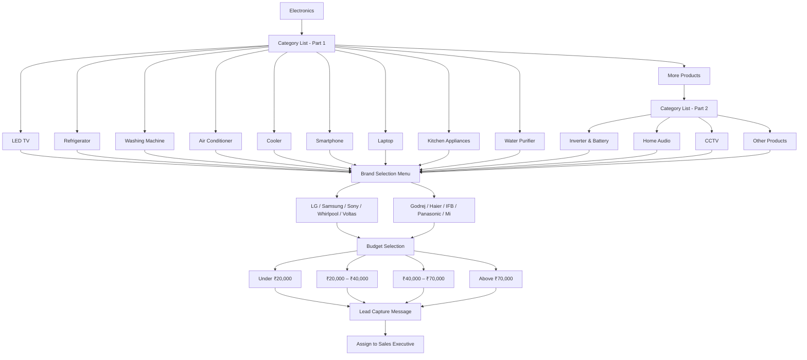
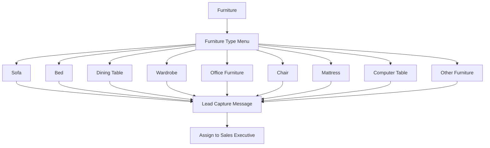
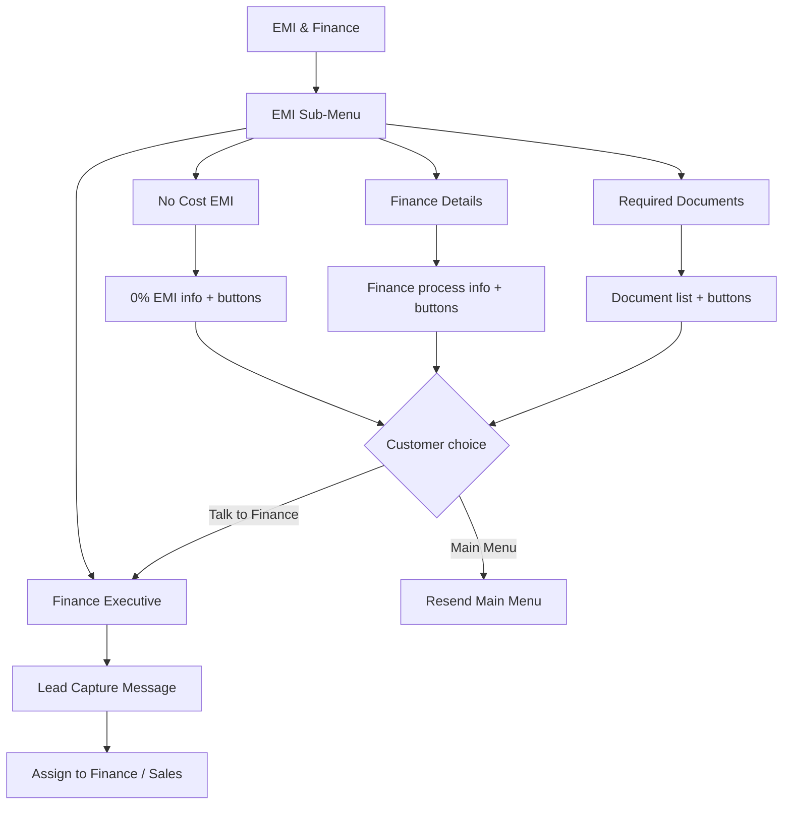
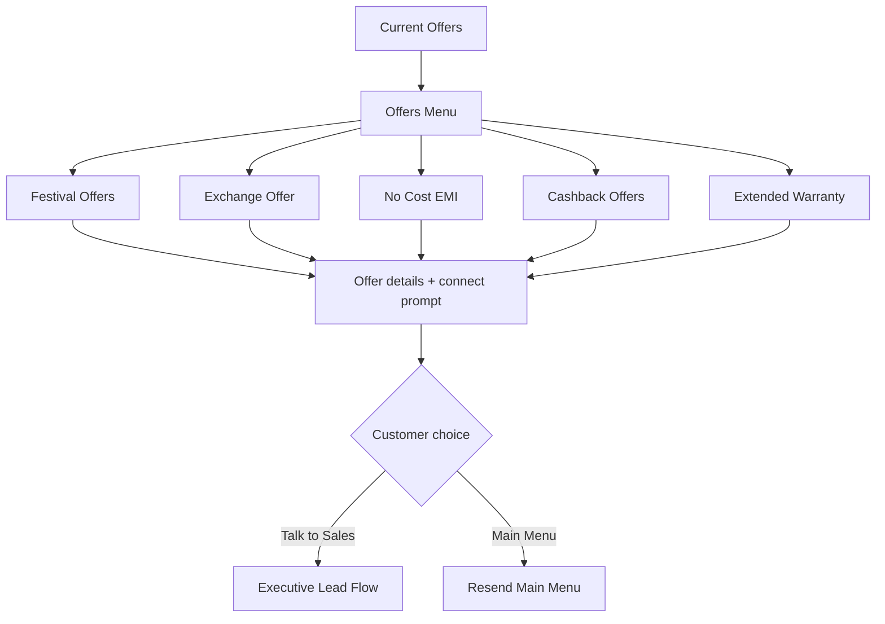
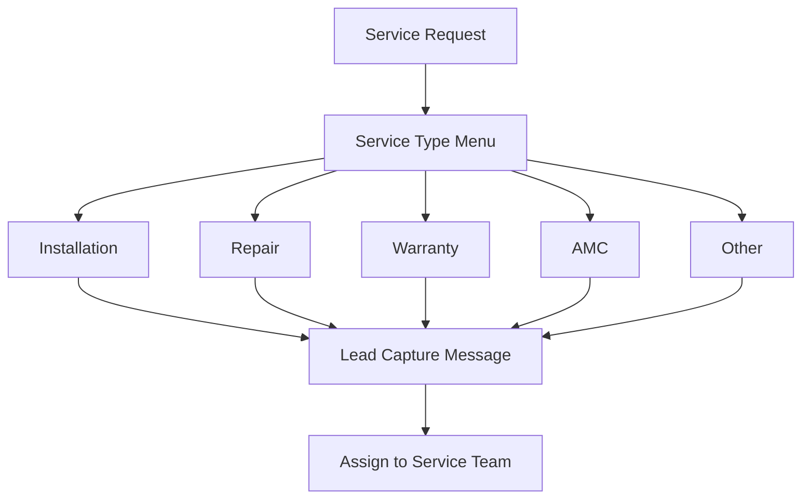
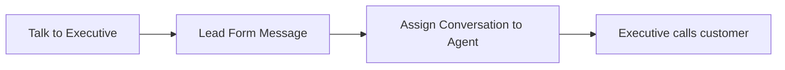
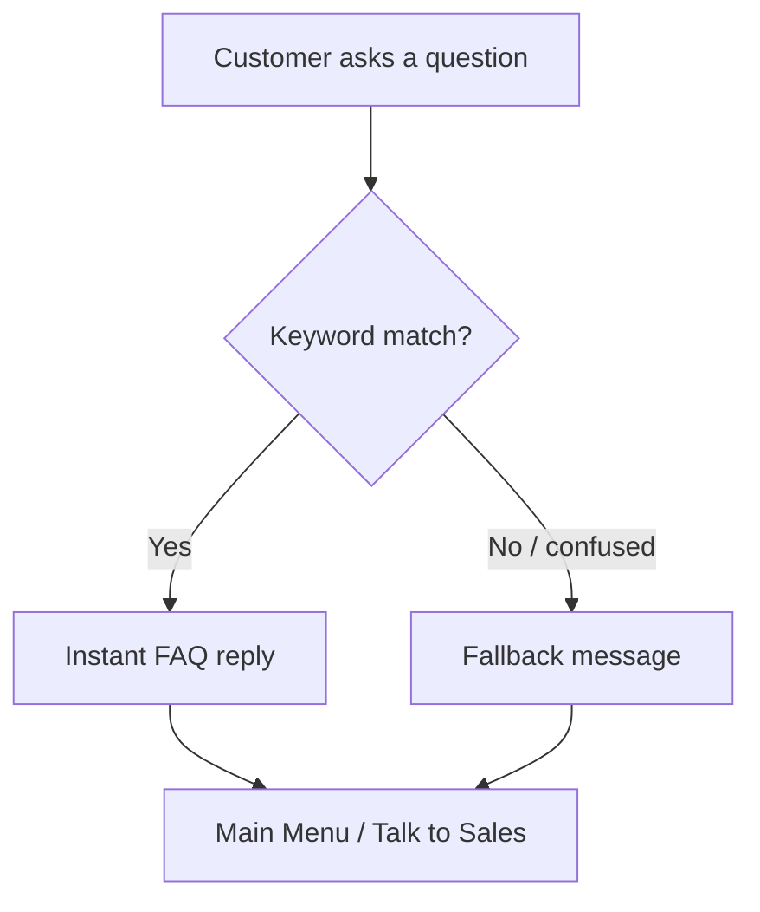

# Anand Radio House — WhatsApp Chatbot Flow

**Business:** Anand Radio House  
**Location:** Main Road, Near SBI, Chitragupt Nagar, Balaghat, Madhya Pradesh  
**Contact:** +91 9589623153  
**Hours:** 10:30 AM – 9:00 PM  

**Platform:** WhatsApp Business API via CRM Automations  
**Total automations:** 51 (Welcome, menus, lead capture, FAQs)

---

## 1. High-Level Overview

The chatbot acts as a **Sales Assistant** — it greets customers, guides them through interactive menus, captures qualified leads, and transfers hot enquiries to a human sales executive.



---

## 2. Entry Point — Welcome & Main Menu

**Trigger:** Customer's first message ever  
**Response:** Welcome text + interactive list menu

### Welcome message

> 🙏 Welcome to Anand Radio House, Balaghat.  
> Your Trusted Electronics & Furniture Store.  
> We are happy to help you.  
> Please choose an option below 👇

### Main menu options

| # | Option | What happens next |
|---|--------|-------------------|
| 1 | Electronics | Product category → Brand → Budget → Lead |
| 2 | Furniture | Furniture type → Lead |
| 3 | EMI & Finance | EMI sub-menu → Finance lead |
| 4 | Current Offers | Offer types → Connect to sales |
| 5 | Service Request | Service type → Lead |
| 6 | Store Location | Address, timing, phone |
| 7 | Talk to Sales Executive | Lead form → Assign to agent |



**Shortcut:** Customer can type **Menu** anytime to receive the main menu again.

---

## 3. Electronics Flow (deepest path)



### Electronics categories

**Part 1:** LED TV · Refrigerator · Washing Machine · Air Conditioner · Cooler · Smartphone · Laptop · Kitchen Appliances · Water Purifier · More Products  

**Part 2:** Inverter & Battery · Home Audio · CCTV · Other Products

### Brand options (all categories)

LG · Samsung · Sony · Whirlpool · Voltas · Godrej · Haier · IFB · Panasonic · Mi / Other

### Budget options

| Range | Option |
|-------|--------|
| Entry | Under ₹20,000 |
| Mid | ₹20,000 – ₹40,000 |
| Premium | ₹40,000 – ₹70,000 |
| High-end | Above ₹70,000 |

### Lead message (after budget selected)

> Thank you! ✅ Your enquiry is registered.  
> Please share in one message: Name · Mobile · City · Product & Brand · Budget  
> Our sales executive will contact you shortly. 📞 9589623153

---

## 4. Furniture Flow



### Lead message

> Please share in one message: Name · Mobile · City · Furniture type · Budget  
> Our team will call you soon. 📞 9589623153

---

## 5. EMI & Finance Flow



### Required documents (shown to customer)

- Aadhar Card  
- PAN Card  
- Bank Passbook  
- Passport Size Photo  
- Salary Slip (if required)

---

## 6. Current Offers Flow



---

## 7. Service Request Flow



### Lead message

> Please share: Name · Mobile · Product name · Issue description · Invoice no. (optional)

---

## 8. Store Location Flow

**Trigger:** Customer selects *Store Location*

**Response:**

> 📍 **Anand Radio House**  
> Main Road, Near SBI, Chitragupt Nagar, Balaghat, MP  
> 🕐 **Timing:** 10:30 AM – 9:00 PM  
> 📞 **Phone:** 9589623153

**Follow-up buttons:** Main Menu · Talk to Sales

---

## 9. Talk to Sales Executive Flow

**Trigger:** Menu option *Talk to Sales Executive* OR customer types: `Executive` · `Sales` · `Human` · `Agent` · `Call me`



### Lead message

> Please share: Your Name · Mobile Number · Reason for call · Preferred time  
> Our sales executive will contact you shortly. 📞 9589623153

---

## 10. FAQ Auto-Replies (18 topics, 100+ keywords)

Customer can ask common questions in natural language anytime. The bot replies instantly and offers **Main Menu** or **Talk to Sales** buttons.

| # | FAQ Topic | Example customer phrases |
|---|-----------|--------------------------|
| 1 | Store Timing | timing, hours, kab khulta, kitne baje |
| 2 | Address & Location | address, kahan hai, directions, balaghat |
| 3 | Contact Number | phone, call, 9589623153 |
| 4 | Delivery | home delivery, delivery charge |
| 5 | Installation | fitting, setup, technician |
| 6 | Warranty | guarantee, extended warranty |
| 7 | Exchange Offer | exchange, old product, trade in |
| 8 | EMI & Finance | emi option, finance facility, no cost emi |
| 9 | Payment Methods | cash, card, upi, gpay, phonepe, paytm |
| 10 | Brands Available | which brand, brand list |
| 11 | Electronics Products | tv available, fridge, ac, laptop |
| 12 | Furniture | sofa available, which bed |
| 13 | Offers & Discount | festival offer, best deal |
| 14 | Stock & Availability | in stock, milega, available hai |
| 15 | Price & Rate | kitne ka, best price, quotation |
| 16 | Returns & Refund | return, replacement |
| 17 | Repair & Service | repair, not working, complaint |
| 18 | Accessories | remote, stand, stabilizer, hdmi |



---

## 11. Fallback & Global Shortcuts

### Fallback (when customer seems confused)

> Sorry, I couldn't understand that. 😊  
> Please choose an option from the menu or type **Menu**.  
> Type **Executive** to talk with our sales team.

**Triggers:** help · what · kya · samjha nahi · understand nahi

### Global shortcuts

| Customer types | Bot action |
|----------------|------------|
| `Menu` · `Main menu` · `Options` · `Start` | Resend main menu |
| `Executive` · `Sales` · `Human` · `Agent` | Executive lead + assign agent |

---

## 12. Lead Collection Summary

Whenever a customer shows buying intent, the bot collects:

| Field | When collected |
|-------|----------------|
| Customer Name | Lead message (customer replies) |
| Mobile Number | Lead message (customer replies) |
| City | Lead message (customer replies) |
| Interested Category | From menu selection path |
| Product | From electronics / furniture menu |
| Brand | From brand menu (electronics) |
| Budget | From budget menu (electronics) |
| Requirement | Customer free-text reply |
| Lead Source | WhatsApp |
| Timestamp | Auto-recorded in CRM |

**After lead capture:** Conversation is **assigned to a sales executive** (round-robin) for follow-up.

---

## 13. Complete Decision Tree (ASCII)

```
CUSTOMER FIRST MESSAGE
        │
        ▼
┌───────────────────┐
│  WELCOME MESSAGE  │
└─────────┬─────────┘
          ▼
┌───────────────────────────────────────────────────────────┐
│                      MAIN MENU (7)                          │
├───┬───┬───┬───┬───┬───┬───────────────────────────────────┤
│ 1 │ 2 │ 3 │ 4 │ 5 │ 6 │ 7                                 │
│ E │ F │EMI│Off│Svc│Loc│Executive                           │
└─┬─┴─┬─┴─┬─┴─┬─┴─┬─┴─┬─┴───────────────────────────────────┘
  │   │   │   │   │   │   │
  ▼   ▼   ▼   ▼   ▼   ▼   ▼
  │   │   │   │   │   │   └──► Lead Form ──► Assign Agent
  │   │   │   │   │   └──────► Address + Timing
  │   │   │   │   └──────────► Service Type ──► Lead ──► Agent
  │   │   │   └──────────────► Offer Type ──► Sales / Menu
  │   │   └──────────────────► EMI Info ──► Finance Lead ──► Agent
  │   └──────────────────────► Furniture Type ──► Lead ──► Agent
  └──────────────────────────► Category ──► Brand ──► Budget ──► Lead ──► Agent

PARALLEL (anytime):
  • FAQ keywords ──► Instant answer ──► Menu / Executive
  • "Menu" ──► Main Menu
  • "Executive" ──► Lead ──► Agent
  • Fallback ──► Help message ──► Menu / Executive
```

---

## 14. Technical Notes (for implementation team)

| Item | Detail |
|------|--------|
| Menu type | WhatsApp Interactive List (up to 10 items) & Buttons (up to 3) |
| Branching | Each menu tap sends a unique ID → triggers matching automation |
| Automations | 51 separate workflows, all active |
| Human handoff | `assign_conversation` step after lead capture |
| CRM inbox | All bot + customer messages visible to agents |

---

*Document generated for Anand Radio House, Balaghat — WhatsApp Sales Assistant Chatbot*  
*Digital One Box Sales CRM*
